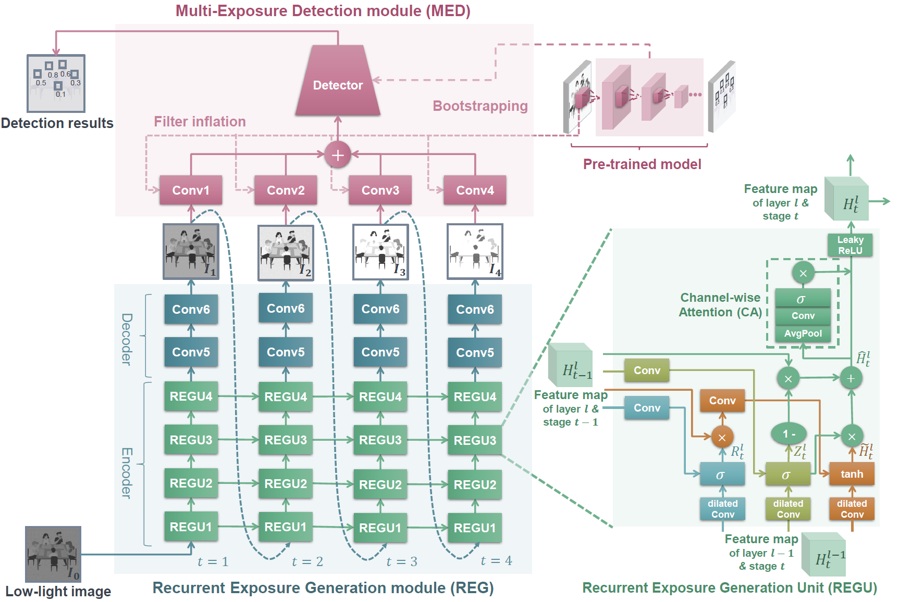

## Recurrent Exposure Generation for Low-Light Face Detection

PyTorch implementation of the
paper [Recurrent Exposure Generation for Low-Light Face Detection](https://ieeexplore.ieee.org/document/9387154/) in TMM
2021.



### Dataset Preparation

The DARK FACE dataset can be downloaded from https://flyywh.github.io/CVPRW2019LowLight/.

Please replace `_C.FACE.DSET_DIR` in the file `data/config.py` with corresponding directory.

### Pretrained Model

This implementation uses PyramidBox as base
detector: [Checkpoint](https://drive.google.com/file/d/1gCaX161GbO-X-e1pX3GPAWUYRhAA4PhM/view?usp=sharing)

## Usage

```bash
bash scripts/test_REGDet_pyramidbox.sh
```

## Dependencies

- easydict==1.9
- torch==0.4.1
- torchvision==0.2.0

## Citation

If you use REGDet for your research, please cite:

```text
@article{liang2021recurrent,
  ids = {liang2020recurrent},
  title = {Recurrent {{Exposure Generation}} for {{Low}}-{{Light Face Detection}}},
  author = {Liang, Jingxiu and Wang, Jingwen and Quan, Yuhui and Chen, Tianyi and Liu, Jiaying and Ling, Haibin and Xu, Yong},
  year = {2021},
  issn = {1941-0077},
  doi = {10.1109/tmm.2021.3068840},
  journal = {IEEE Transactions on Multimedia},
}
```
